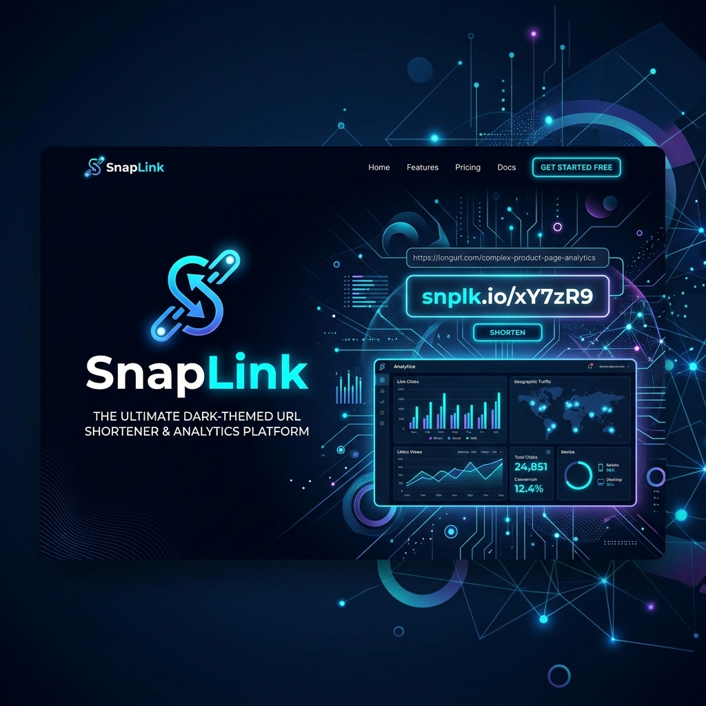

# 🔗 SnapLink



**SnapLink** is a modern, high-performance, open-source URL shortener. Built with a sleek interface and a blazingly fast backend, it features a comprehensive analytics dashboard that allows you to instantly track every click, geolocate your audience, and analyze device metrics.

---

## ✨ Features

- 🚀 **Lightning Fast Redirects**: Caches short links in Redis for instant <10ms redirects.
- 📊 **Advanced Analytics Dashboard**: Real-time click tracking, charting, and statistics.
- 🌍 **Geolocation & Device Parsing**: Tracks countries, cities, browsers, OS, and device types for every visitor.
- 🔐 **Secure Authentication**: JWT-based user accounts and protected dashboards.
- 🎨 **Modern Interface**: A stunning, responsive UI built with Next.js, TailwindCSS, and sleek micro-animations.
- 🛡️ **Rate Limiting & Security**: Built-in protection against spam and abuse.
- 🏷️ **Custom Aliases**: Choose your own custom short codes for memorable links.

## 🛠️ Technology Stack

### Frontend
- **Framework**: Next.js 14 (App Router)
- **Styling**: Tailwind CSS
- **Icons**: Lucide React
- **Charts**: Recharts
- **HTTP Client**: Axios

### Backend
- **Framework**: FastAPI (Python 3)
- **Database**: PostgreSQL (Neon)
- **ORM & Migrations**: SQLAlchemy & Alembic
- **Caching**: Redis
- **Authentication**: JWT (JSON Web Tokens)

---

## 🚀 Quick Start (Local Development)

### Prerequisites
Make sure you have the following installed on your machine:
- Node.js (v18+)
- Python (3.11+)
- PostgreSQL (or a Neon DB)
- Redis

### 1. Backend Setup

Open a terminal and navigate to the `backend` directory:
```bash
cd backend
```

Create a virtual environment and install the dependencies:
```bash
python -m venv venv
source venv/bin/activate  # On Windows use: venv\Scripts\activate
pip install -r requirements.txt
```

Set up your environment variables by copying the example file:
```bash
cp .env.example .env
```
*Edit `.env` and configure your `DATABASE_URL`, `REDIS_URL`, and `SECRET_KEY`.*

Run database migrations to generate the tables:
```bash
alembic upgrade head
```

Start the FastAPI development server:
```bash
uvicorn app.main:app --reload --port 8000
```
*Your backend is now running at `http://localhost:8000`.*

### 2. Frontend Setup

Open a new terminal and navigate to the `frontend` directory:
```bash
cd frontend
```

Install the dependencies:
```bash
npm install
```

Set up your environment variables by copying the example file:
```bash
cp .env.example .env.local
```
*Edit `.env.local` and ensure `NEXT_PUBLIC_API_URL` points to your backend (e.g., `http://localhost:8000`).*

Start the Next.js development server:
```bash
npm run dev
```
*Your frontend is now running at `http://localhost:3000`.*

---

## 🚀 Deployment

SnapLink is designed to be easily deployed to modern cloud platforms:

- **Frontend**: Deploy to [Vercel](https://vercel.com/) for zero-config Next.js hosting.
- **Backend**: Deploy to [Render](https://render.com/) or [Railway](https://railway.app/). Ensure your platform supports Redis and PostgreSQL.

### Critical Environment Variables for Production
- **Backend**: `BASE_URL`, `FRONTEND_URL`, `DATABASE_URL`, `REDIS_URL`, `SECRET_KEY`
- **Frontend**: `NEXT_PUBLIC_API_URL`

---

## 📝 License

This project is licensed under the MIT License. Feel free to use, modify, and distribute as you see fit.
